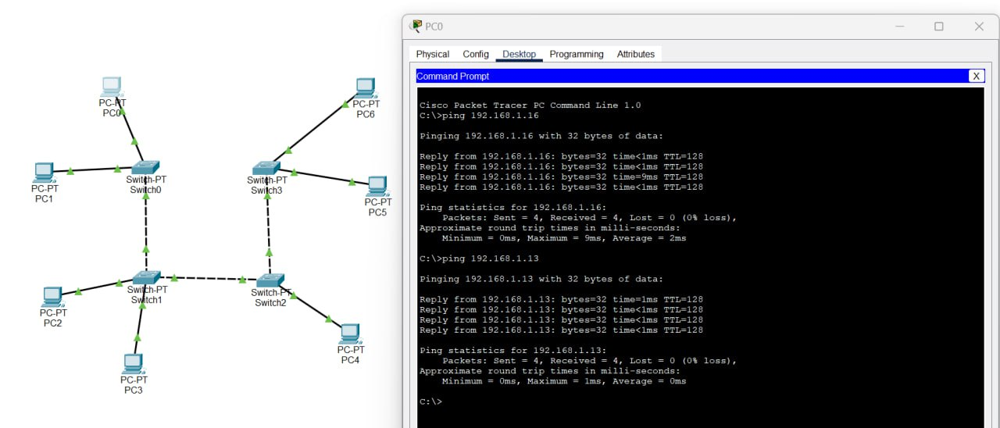
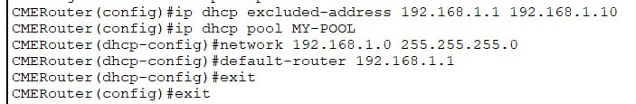

# Лабораторная работа №1 "Базовая настройка ip-телефонов в среде Сisco packet tracer"
University: [ITMO University](https://itmo.ru/ru/)

Faculty: [FICT](https://fict.itmo.ru)

Course: [IP telephony technologies](https://itmo-ict-faculty.github.io/ip-telephony/)

Year: 2023/2024

Group: K34212

Author: Tikhonov Stepan Nikolaevich

Lab: Lab1

Date of create: 20.02.2024

Date of finished: 21.02.2024

## Цель работы: 

Изучить рабочую среду Cisco Packet Tracer, ознакомиться с интерфейсами основных устройств, типами кабелей, научиться собирать топологию. Изучить построение сети IP-телефонии с помощью маршрутизатора, коммутатора и IP телефонов Cisco 7960 в среде Packet tracer.

## Ход работы:

- ### Часть 1

В среде Cisco Packet Tracer была собрана схема соединения, а затем были настроены статические ip адреса на каждый пк из диапазона `192.168.1.10-192.168.1.16` с маской `255.255.255.0`, в результате получаем возможность пинга между разными пк в схеме:

- ### Часть 2

В среде Cisco Packet Tracer была собрана схема соединения, как указано в методичке, имя маршрутизатора было изменено на CMERouter.
Также маршрутизатор был настроен для корректной работы-был настроен dhcp pool адресов и включена опция 150 и настроен telephony-service, также был настроен интерфейс, на который был добавлен ip адрес:

На свиче настроим порты, к которым подключены телефоны и переведем их в access для vlan 1, настроенного для телефонов:

В результате мы получаем возможность звонить с телефонов:

## Вывод:

При выполнении работы в среде Cisco Packet Tracer были построены две топологии сети. Были изучены базовый функционал Cisco Packet Tracer, настройка сети IP-телефонии.