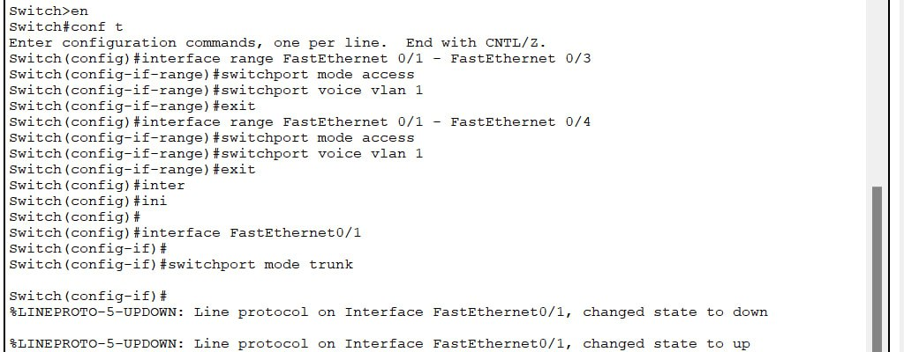
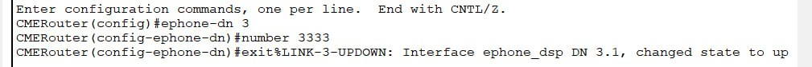
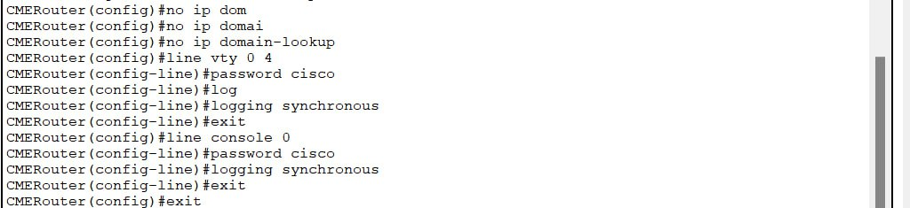
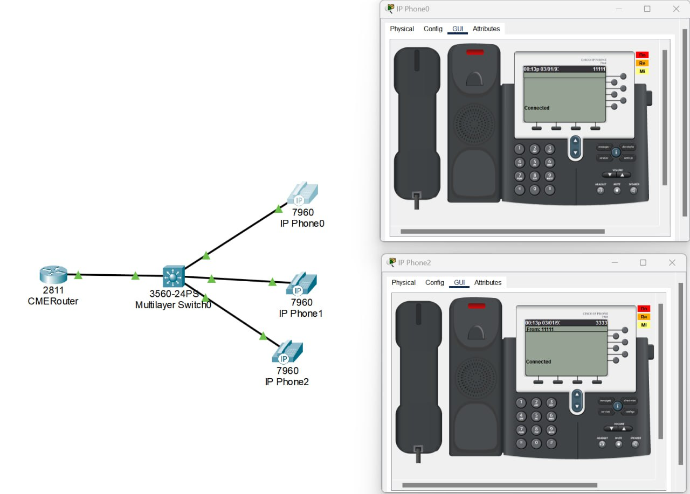
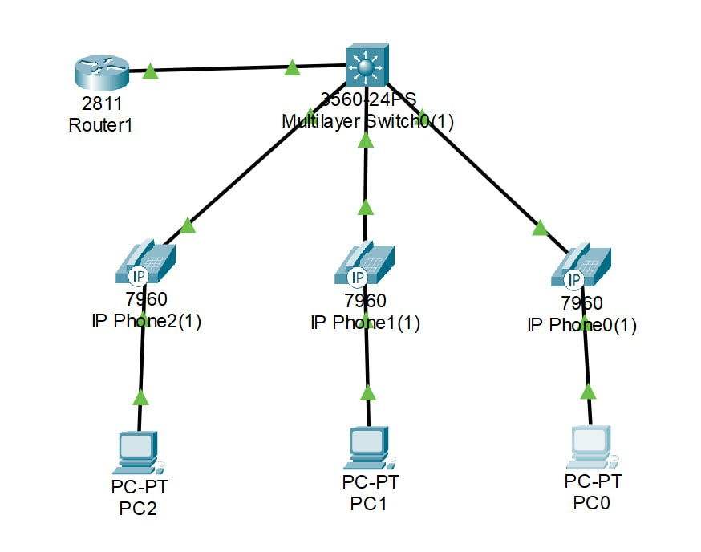
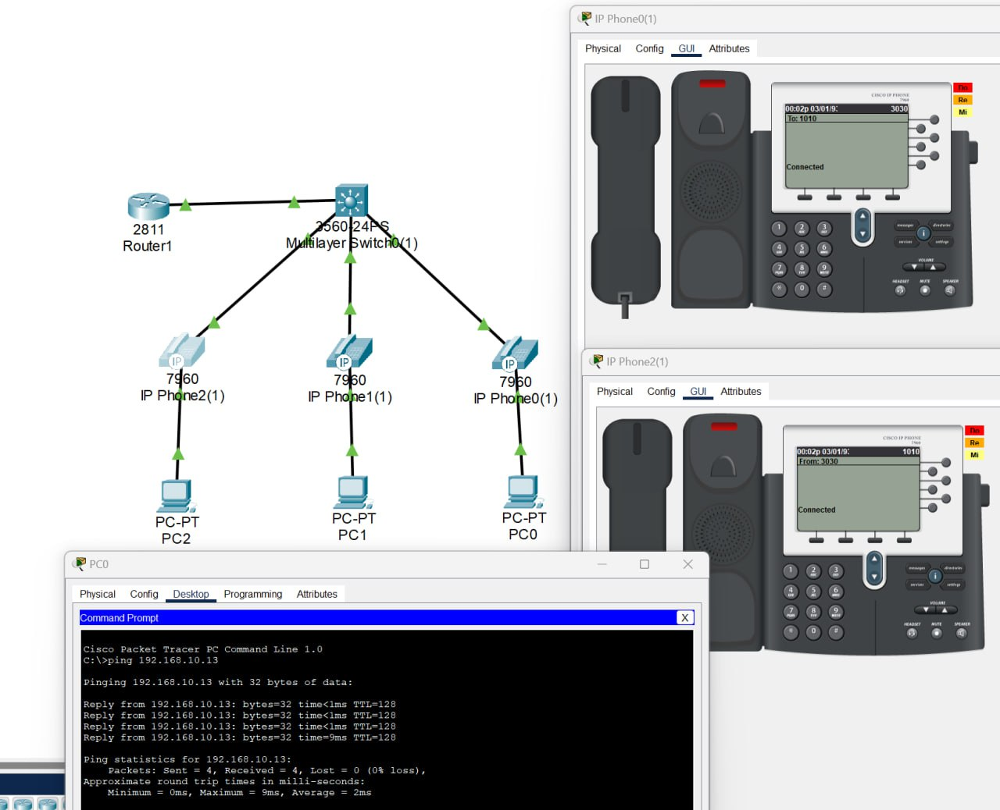

# Лабораторная работа №2 "Конфигурация voip в среде Сisco packet tracer"
University: [ITMO University](https://itmo.ru/ru/)

Faculty: [FICT](https://fict.itmo.ru)

Course: [IP telephony technologies](https://itmo-ict-faculty.github.io/ip-telephony/)

Year: 2023/2024

Group: K34212

Author: Tikhonov Stepan Nikolaevich

Lab: Lab2

Date of create: 25.02.2024

Date of finished: 26.02.2024

## Цель работы: 

Изучить построение сети IP-телефонии с помощью маршрутизатора Cisco 2811, коммутатора Cisco catalyst 3560 и IP телефонов Cisco 7960.

## Ход работы:

### Часть 1

В Cisco Packet Tracer была собрана схема соединения из роутера, коммутатора и 3 телефонов, настройка системы проходила 
аналогично настройке 2 части ЛР1, за исключением того, что на этот раз в системе 3 телефона, а не 2, поэтому часть работ,
проведенных в ЛР1 будет опущена. Для работы с 3 телефонами был донастроен коммутатор и порт для нового телефона:



Затем на роутере был добавлен 3-ий телефон, а также была настроена защита роутера:




В результате получаем такую схему и возможность звонить между телефонами:



### Часть 2

В среде Cisco Packet Tracer была собрана схема соединения:



Затем были настроены 2 VLAN на коммутаторе, один для передачи данных, другой-для голоса:

```
Switch(config)#vlan 10
Switch(config-vlan)#name DATA
Switch(config-vlan)#vlan 20
Switch(config-vlan)#name VOICE
```

Интерфейс коммутатора, идущий к роутеру переведен в режим trunk, чтобы по нему могли идти созданные VLANы:

```
Switch(config)#interface FastEthernet 0/1
Switch(config-if)#switchport mode trunk
Switch(config-if)#switchport trunk allowed vlan 1,10,20
```

Оставшиеся интерфейсы коммутатора настроены в режим access для vlan 10 и voice vlan 20:

```
Switch(config)#interface range FastEthernet 0/22-24
Switch(config-if-range)#switchport access vlan 10
Switch(config-if-range)#switchport voice vlan 20
```

На роутере были настроены саб-интерфейсы для двух VLANов, им были назначены IP–адреса:

```
Router(config-subif)#interface FastEthernet0/0
Router(config-subif)#no shutdown
Router(config-subif)#interface FastEthernet0/0.10
Router(config-subif)#encapsulation dot1Q 10
Router(config-subif)#ip address 192.168.10.1 255.255.255.0
Router(config-subif)#interface FastEthernet0/0.20
Router(config-subif)#encapsulation dot1Q 20
Router(config-subif)#ip address 192.168.20.1 255.255.255.0
```

Также на роутере настроен DHCP-сервер для 2 VLANов:

```
Router(config)#ip dhcp pool DATA
Router(dhcp-config)#network 192.168.10.0 255.255.255.0
Router(dhcp-config)#default-router 192.168.10.1
Router(dhcp-config)#ip dhcp pool VOICE
Router(dhcp-config)#network 192.168.20.0 255.255.255.0
Router(dhcp-config)#default-router 192.168.20.1
Router(dhcp-config)#option 150 ip 192.168.20.1
```

Далее на роутере настроены параметры telephony-service:

```
Router(config)#telephony-service
Router(config-telephony)#max-dn 15
Router(config-telephony)#max-ephones 15
Router(config-telephony)#ip source-address 192.168.20.1 port 3100
Router(config-telephony)#auto assign 1 to 15
```

Теперь присвоим телефонам номера:

```
CMERouter(config)#ephone-dn 1
CMERouter(config-ephone-dn)#number 1010
CMERouter(config-ephone-dn)#exit
CMERouter(config)#ephone-dn 2
CMERouter(config-ephone-dn)#number 2020
CMERouter(config-ephone-dn)#exit
CMERouter(config)#ephone-dn 3
CMERouter(config-ephone-dn)#number 3030
```

В результате получаем такую схему и возможность звонить с телефонов и пинговать пк:



## Вывод:

При выполнении работы в среде Cisco Packet Tracer были построены две топологии сети. Были получены навыки по построению сетей IP-телефонии.