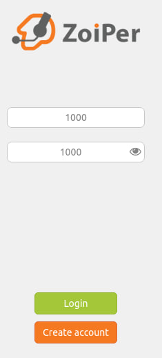

##### University: [ITMO University](https://itmo.ru/ru/)
##### Faculty: [FICT](https://fict.itmo.ru)
##### Course: [ip-telephony](https://itmo-ict-faculty.github.io/ip-telephony/)
##### Year: 2023/2024
##### Group: K34202
##### Author: Tikhonov Stepan Nikolaevich
##### Lab: Lab3
##### Date of create: 01.03.2024
##### Date of finished: 02.03.2024

***

# Отчёт по лабораторной работе №3 "Использование Asterisk в качестве SIP proxy"


## **Цель работы:** 
Изучить ПО Asterisk. Настройка Asterisk для локальных звонков.

## **Ход работы:**
Работа выполняется на ВМ Ubuntu.

### Установика Asterisk.
Установим Asterisk командой:
```
sudo apt-get install asterisk
```


### Настрйка SIP каналов.
В файл /etc/asterisk/sip.conf была добавлена информация о телефонах 1000 и 1001:
```
[1000]
type=friend
host=dynamic
secret=1000
context=ext_1000
```
```
[1001]
type=friend
host=dynamic
secret=1001
context=ext_1001
```

В extensions.conf был определен тип канала – SIP:
```
[ext_1000]
exten => _XXXX,1,Dial(SIP/${EXTEN})
```
```
[ext_1001]
exten => _XXXX,1,Dial(SIP/${EXTEN})
```
Asterisk был перезапущен после изменения файлов:
```
sudo service asterisk restart
```

Проверим его статус:


### Установика soft телефонов на рабочую станцию и подключение к SIP каналам soft телефона.
Установим soft телефон Zoiper с оффициального сайта.

Зайдем под именем телефона 1000:



В качестве хоста указваем localhost.

Проверим подключение:
```
sudo asterisk
sip show peers
```


### Тестовый звонок на номер 1000
Наберем номер 1000:


Звонок идет, значит телефон настроен правильно.

## **Вывод:** 

В результате выполнения работы были изучены Asterisk и настройка Asterisk для локальных звонков.